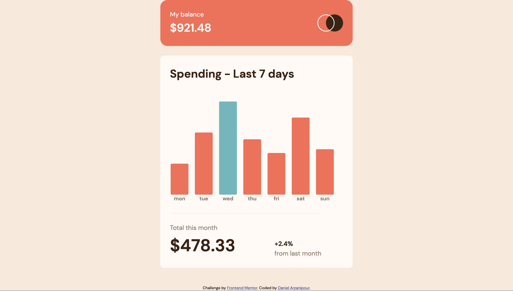

# Frontend Mentor - Expenses chart component solution

This is a solution to the [Expenses chart component challenge on Frontend Mentor](https://www.frontendmentor.io/challenges/expenses-chart-component-e7yJBUdjwt). Frontend Mentor challenges help you improve your coding skills by building realistic projects.

## Table of contents

- [Overview](#overview)
  - [The challenge](#the-challenge)
  - [Screenshot](#screenshot)
  - [Links](#links)
- [My process](#my-process)
  - [Built with](#built-with)
  - [What I learned](#what-i-learned)
  - [Testing](#testing)
  - [Continued development](#continued-development)
  - [Useful resources](#useful-resources)
- [Author](#author)
- [Acknowledgments](#acknowledgments)

## Overview

### The challenge

Users should be able to:

- View the bar chart and hover over the individual bars to see the correct amounts for each day
- See the current day’s bar highlighted in a different colour to the other bars (_admittedly I didn't do a good job of reading this part, in the design files, the highest bar was coloured differently and so I thought that the largest expenditure was suppose to be what I should have coloured cyan_)
- View the optimal layout for the content depending on their device’s screen size
- See hover states for all interactive elements on the page
- **Bonus**: Use the JSON data file provided to dynamically size the bars on the chart

### Screenshot



### Links

- [Live Site URL](https://sage-cupcake-7d8d9a.netlify.app)

## My process

### Built with

- Semantic HTML5 markup
- SCSS
- Typescript
- Gulp
- Vitest
- TSDocs

### What I learned

- When starting this project, my first thought was what html elements should I be using for the bars and some of the numbers. I wasn't so sure that divs and paragraph elements would be the best semantic choice (_especially since I had heard from a senior software engineer that you shouldn't have empty divs_)

  - I thought about using the `meter` and `output` tags but since this chart isn't a form I didn't go along with them
  - After doing some more research I found an example where I could use a table itself and style it like a bar graph, so I did that

- The title attribute is supposed to be very in-accessible so I used a pseudo element and had that appear on hover and focus and styled it to be my custom tooltip. Since this chart is actually a table it would already be accessible to screen readers so I didn't go through all the trouble of creating a new element and adding aria-roles in order to create a custom tooltip

- Typescript would throw errors at me when trying to pass in the type for my fetch request as well as when I tried to catch errors

  - For the first problem, I had to use generics to solve them

  ```typescript
  async function getExpenses<T>(url: string): Promise<T> {
    try {
      const res = await fetch(url);
      const data = await res.json();
      return data;
    } catch (error) {
      throw new validationError(getErrorMessage(error));
    }
  }
  ```

  - For the second problem, I found an article by Kent C Dodds where he went over why Typescript would give me problems when using `catch` blocks, it turns out that even when something seems impossible in Javascript, its actually quite possible. I used his solution which was to create this re-usable utility function

  ```typescript
  export function getErrorMessage(error: unknown) {
    if (error instanceof Error) return error.message;
    return String(error);
  }
  ```

- I couldn't interact with the bar graph using a keyboard
  - I had to add a tabIndex value in order to fix it, though this can create frustrating a user experience, in this case it should only be helpful

### Testing

This site/app was tested using:

- Firefox, chrome and safari
- Phone
- [Html validator](https://validator.w3.org/)
- Screen reader
- Chrome extensions
  - Wave, Axe, Lighthouse
  - Accessibility insights
    - Css UnStyler
    - ColorBlindly
    - High Contrast
    - Responsive Viewer
- vitest
- Navigating using keyboard
- viewed on small phone screens eg 320px wide like old iPhone 12 mini or iPhone SE
- Viewed on those screens in landscape as well as portrait
- Zoomed in on the screen to 200%
- Zoomed in to 400%
- Changed base font size on desktop browser to 32px
- Changed base font size on desktop to 64px

### Continued development

- I would create an alternative table so that if this interactive bar graph isn't accessible for any reason, people can just look at the table instead

- When attempting to use this on a touch device, you have to press on one of the bars and hold it for the value to display, I would add a fix for this.

### Useful resources

- [Accessible Graph Charts](https://css-tricks.com/making-charts-with-css/)
- [Heydon Pickerings Inclusive Components](https://inclusive-components.design/)
- [Using fetch with generics in typescript](https://www.carlrippon.com/fetch-with-async-await-and-typescript/)
- [Dealing with catch block errors in typescript](https://kentcdodds.com/blog/get-a-catch-block-error-message-with-typescript)

## Author

- [Portfolio Website](https://daniel-arzani-portfolio.netlify.app/)
- [Frontend Mentor Profile](https://www.frontendmentor.io/profile/DanielArzani)

## Acknowledgments

- The frontend mentor platform for the challenge and the design files

- The frontend mentor slack platform which is incredibly helpful for peer review, especially on the topics of accessibility and best practices
